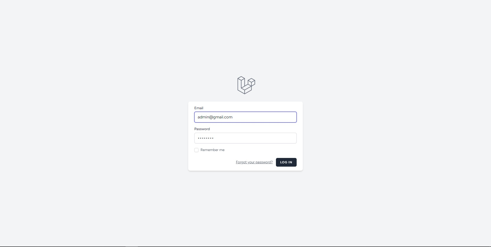
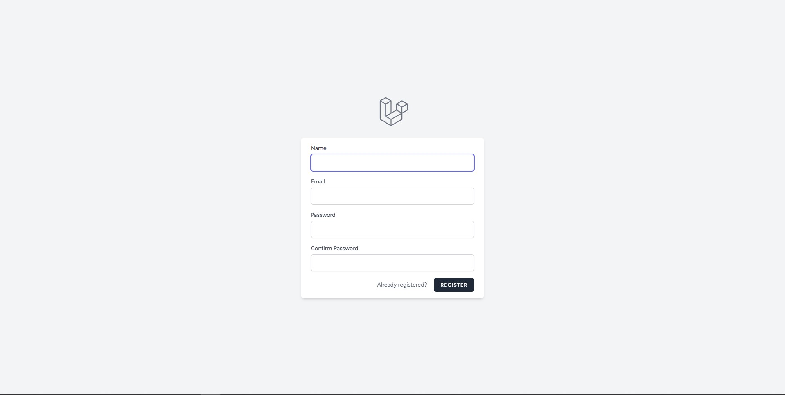
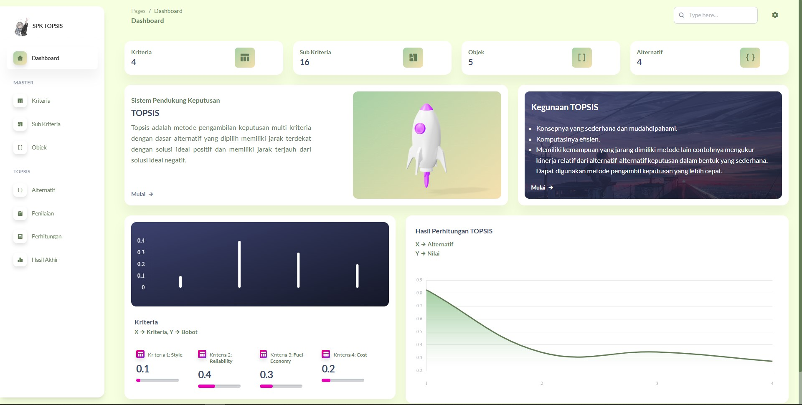
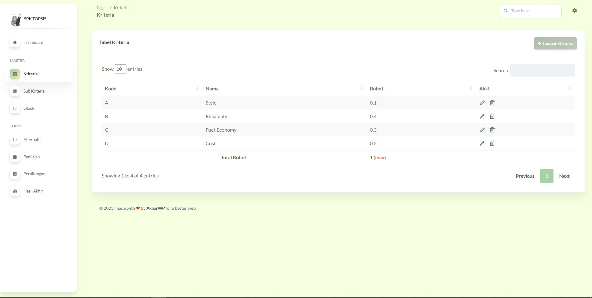
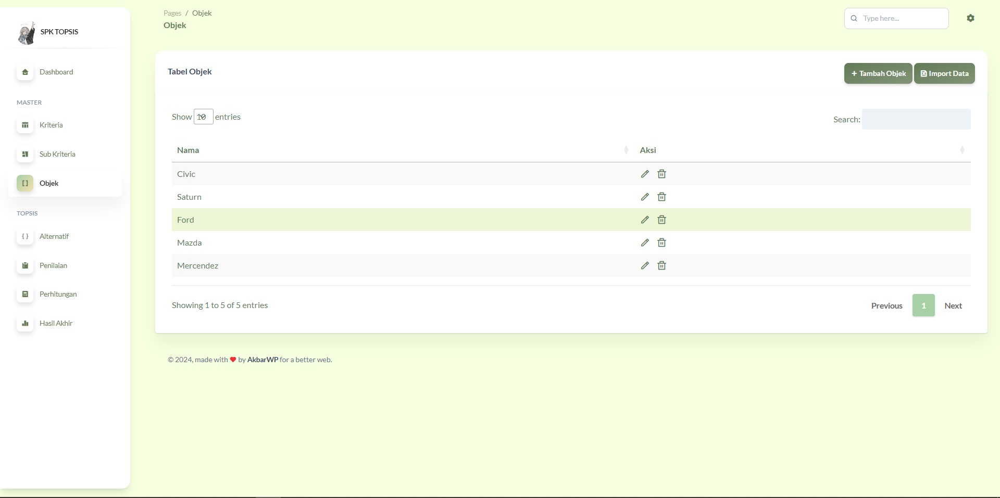
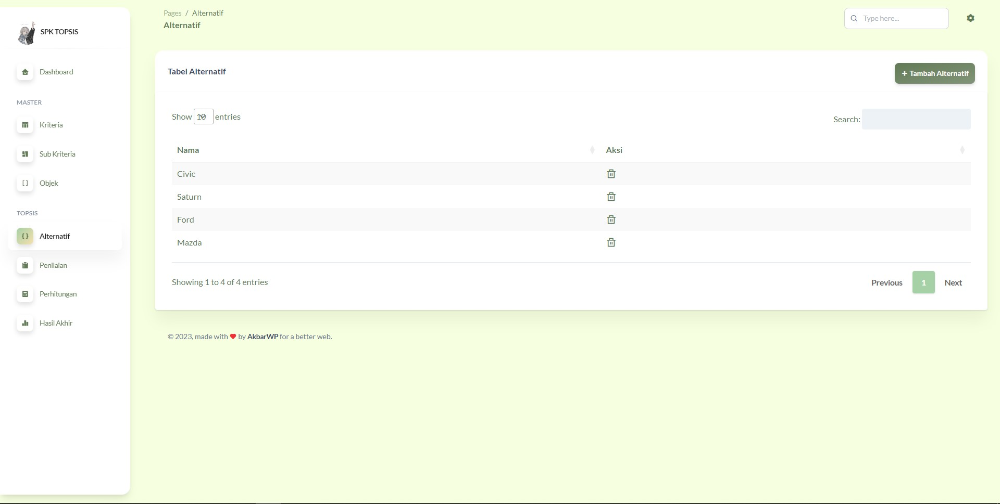
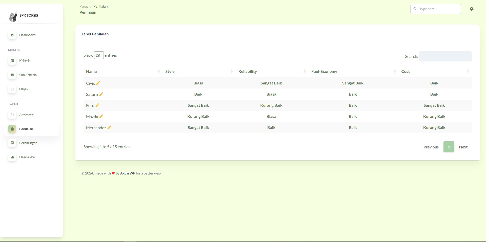
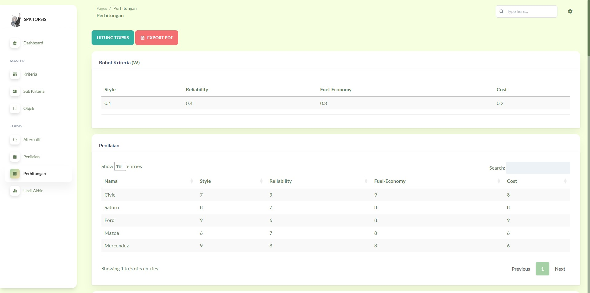
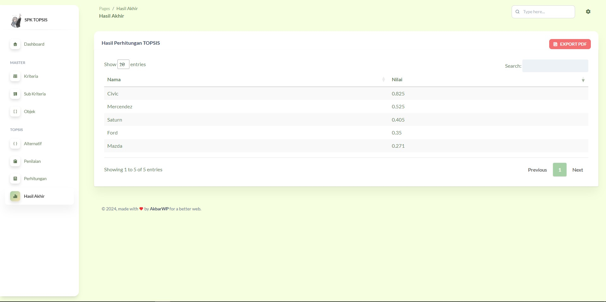

# Laravel SPK TOPSIS

Laravel SPK TOPSIS is a website designed to provide a decision support system using the TOPSIS (Technique for Order Preference by Similarity to Ideal Solution) method. This site enables users to analyze various decision alternatives based on defined criteria, assisting in determining the best choice in a systematic and transparent way. With a user-friendly interface, users can easily input data and obtain in-depth analysis results to support more accurate decision-making.

## Tech Stack

- **Laravel 9**
- **Laravel Breeze**
- **MySQL Database**
- **TailwindCSS**
- **daisyUI**
- **[maatwebsite/excel](https://laravel-excel.com/)**
- **[barryvdh/laravel-dompdf](https://github.com/barryvdh/laravel-dompdf)**

## Features

- Main features available in this application:
  - Implementation TOPSIS method

## Installation

Follow the steps below to clone and run the project in your local environment:

1. Clone repository:

    ```bash
    git clone https://github.com/Akbarwp/Laravel-SPK-TOPSIS.git
    ```

2. Install dependencies use Composer and NPM:

    ```bash
    composer install
    npm install
    ```

3. Copy file `.env.example` to `.env`:

    ```bash
    cp .env.example .env
    ```

4. Generate application key:

    ```bash
    php artisan key:generate
    ```

5. Setup database in the `.env` file:

    ```plaintext
    DB_CONNECTION=mysql
    DB_HOST=127.0.0.1
    DB_PORT=3306
    DB_DATABASE=laravel_topsis
    DB_USERNAME=root
    DB_PASSWORD=
    ```

6. Run migration database:

    ```bash
    php artisan migrate
    ```

7. Run seeder database:

    ```bash
    php artisan db:seed
    ```

8. Run website:

    ```bash
    npm run dev
    php artisan serve
    ```

## Screenshot

- ### **Login & Register page**


&nbsp;&nbsp;&nbsp;

<br><br>

- ### **Dashboard**


<br><br>

- ### **Criteria page**


<br><br>

- ### **Sub Criteria page**


<br><br>

- ### **Object & Alternative page**


&nbsp;&nbsp;&nbsp;

<br><br>

- ### **Result page**


&nbsp;&nbsp;&nbsp;

&nbsp;&nbsp;&nbsp;

<br><br>
